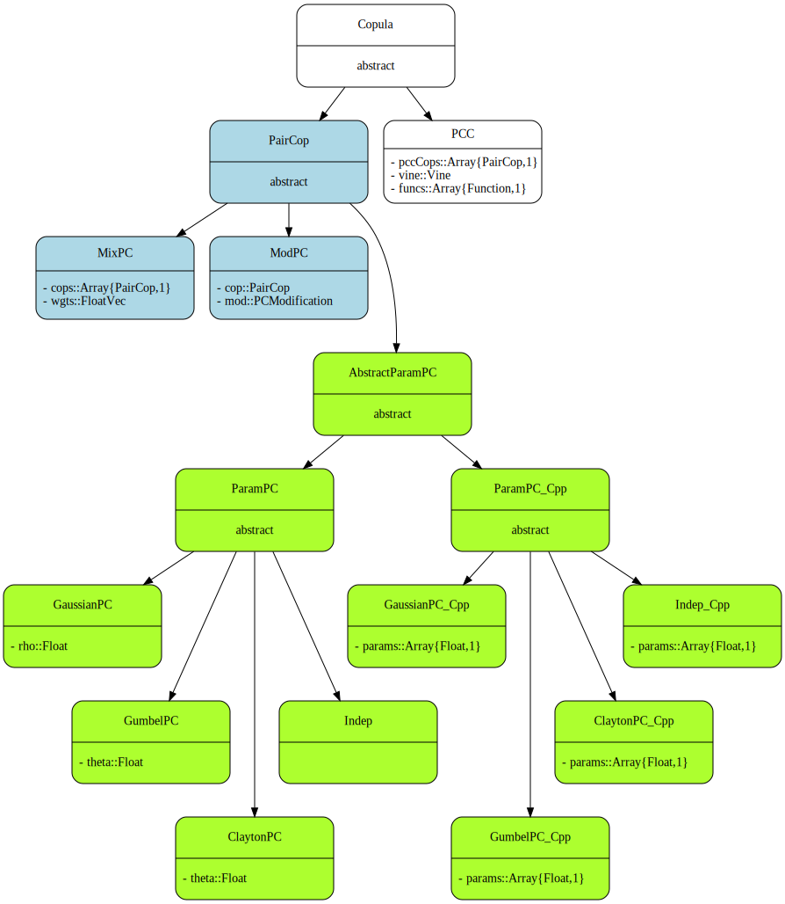
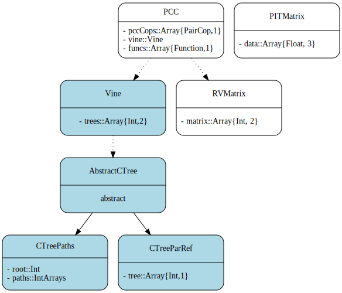

Documentation
=============

Type hierarchy
--------------

The very top of the type hierarchy is type `Copula`, which subsumes
all other types of copulas. It splits up into bivariate pair copulas
of type `PairCop` on the one side, and type `PCC` on the other side.

`PCC` represents pair copula constructions. This is a flexible way of
constructing higher-dimensional copulas, where any subtype of type
`PairCop` can be used as a bivariate building block.

Furthermore, there are different types of `PairCop` copulas. One
fundamental type of pair copulas is the family of parametric copulas,
represented by type `AbstractParamPC`. Parametric copulas also can be
used as starting point for the creation of new pair copulas. 

One way to create new pair copulas is through application of a copula
modification, which for example could be a rotation or a reflection.
These types of modified copulas are subsumed in type `ModPC`, and
their type hierarchy is shown more elaborately below.

A different way to create new pair copulas is through convex
combination of existing pair copulas, called mixture copulas, and is
implemented as type `MixPC`.

Note that we face a reflexive structure at this point: `ModPC` and
`MixPC` types both are built on pair copulas, but they are pair
copulas themselves, too.

Parametric pair copulas build the very core of this package, as they
are required both as starting point for copula modifications and for
pair copula constructions. However, most parametric copula families
are not yet implemented in core Julia yet. Hence, in the meantime,
there exist two different representations of parametric copulas:
`ParamPC`, which is a pure Julia implementation for a few parametric
families, and `ParamPC_Cpp`, which makes use of the C++ copula package
`VineCopulaCPP`.

Every abstraction on top of parametric copulas, however, is written in
pure Julia.

Possible extensions in the type hierarchy are:

- multivariate parametric copulas
- multivariate non-parametric copulas
- bivariate non-parametric copulas

Pair copula construction: related types
---------------------------------------

A pair copula basically consists of two things: a description of the
density decomposition (called vine), and copulas to capture the
dependency between individual pairwise relations.

The conventional way to represent a density decomposition is through
an R-Vine matrix. However, a vine evenly could be described as an
array of individual **conditioning trees**, one for each variable.

There are two different representations of conditioning trees: types
`CTreePaths` and `CTreeParRef`. For reasons of efficiency, however, a
`Vine` is not stored as `Array` of `AbstractCTree`, but as a single
two-dimensional matrix, where each column is a conditioning tree in
parent referencing notation.

Copula modifications
--------------------

A copula modification consists of a given pair copula together with
some modification operation. The most prominent such modifications are
rotations and reflections.

As there has not yet evolved any standard of whether rotations are
defined clockwise or counter-clockwise, both ways are implemented.

Copula theory
-------------

For details on the underlying copula theory take a look at my [research
notes](http://cgroll.github.io/copula_theory/index.html).

# Acknowledgements

In its current version, `Copulas.jl` basically is only a wrapper to
the fabulous
[VineCopulaCPP](https://github.com/MalteKurz/VineCopulaCPP) c++
library of [Malte Kurz](https://github.com/MalteKurz). `VineCopulaCPP`
is a well tested library comprising parametric copulas with all
their respective functions (pdf, cdf,...), as well as simulation
routines and optimization algorithms for copula estimation.
