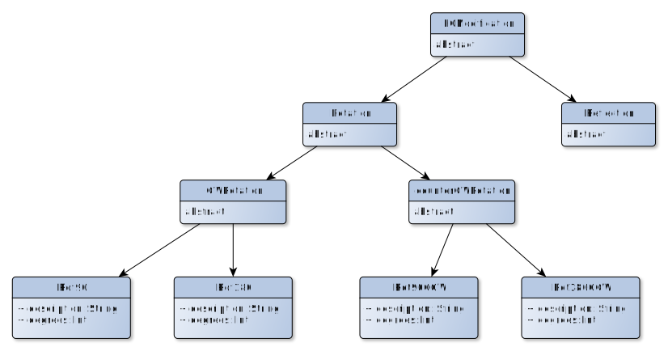

Documentation
=============

Type hierarchy
--------------

Copula modifications
--------------------

Copula theory
-------------

For details on the underlying copula theory take a look at my [research
notes](http://cgroll.github.io/copula_theory/index.html).

# Acknowledgements

In its current version, `Copulas.jl` basically is only a wrapper to
the fabulous
[VineCopulaCPP](https://github.com/MalteKurz/VineCopulaCPP) c++
library of [Malte Kurz](https://github.com/MalteKurz). `VineCopulaCPP`
is a well tested library comprising parametric copulas with all
their respective functions (pdf, cdf,...), as well as simulation
routines and optimization algorithms for copula estimation.
